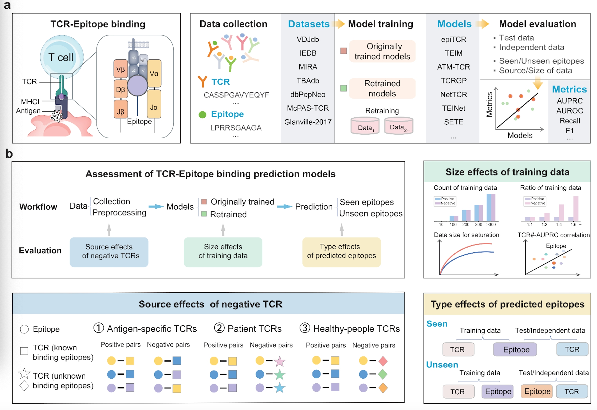

<h1 align="center">
 TCREpitopeBenchmark
</h1>

## Overview
> In this study, we conducted a comprehensive evaluation of TCR and epitope prediction models, focusing on their performance in both seen and unseen epitope scenarios and identifying key factors that influence model performance.


	
## Code Structure
We have developed three modules for each model: (1)original model-based prediction, (2)model retraining, and (3)retrained model-based prediction on both seen and unseen data. You can select either to retrain the model or to generate predictions depending on your requirements. The relevant code for each model, contained in a Jupyter notebook, is saved in a separate folder with a file name that matches the model's name. Additionally, we provide the process for preprocessing all original datasets ```(Original_model_data_statistics.ipynb)```, the process for preprocessing retrained datasets ```(Raw_database_data_filtering.ipynb)```, the process for matching negative datasets ```(Negative_dataset_matching.ipynb)```, and the plotting process for all figures in the article ```(fig)```.


## Requirements
During the environment setup process, due to the differing versions of various Python packages used by different models, when running each model, we referred to the requirements file provided by the original model's GitHub repository and configured an individual environment for each model. We stored the environments for running all the models in the ``` environment ``` folder.
## Input File Formatting Format

The input file should be a CSV with the following format:
```
Epitope,CDR3B,Affinity
```

Where epitope and TCR are the linear protein sequences and binding affinity is either 0 or 1.

```
# Example
Epitope,CDR3B,Affinity
GLCTLVAML,CASSEGQVSPGELF,1
GLCTLVAML,CSATGTSGRVETQYF,0
```

If your data is unlabeled and you are only interested in the predictions, simply put either all 0's or all 1's as the label. The performance statistics can be ignored in this case and the predicted binding affinity scores can be collected from the output file.

## Predictions with the Original Model
We have organized the prediction code for each original model, which is stored in the first module of the Jupyter notebook in each model folder. It has been encapsulated into a function named ```Original_model_prediction```. Using the ATM-TCR model as an example, you can directly run this function in the Jupyter notebook located in the ATM_TCR folder. For usage, refer to the following command:
```
testfile_path="../data/test.csv"
modelfile_path="../Original_model/ATM_TCR.ckpt"
result_path="../result_path/Original_model_prediction"
Original_model_prediction(testfile_path,modelfile_path,result_path)
```

The remaining original models have been saved on the figshare website. You can download them by visiting this link (https://doi.org/10.6084/m9.figshare.27020455) and navigating to the "Original_model" folder.

## Retrained Models 
We have refactored the training and testing code for each model into a function named ```Model_retraining```. You can directly call this function in the second module of the Jupyter notebook within the respective model folder. Using the ATM-TCR model as an example, for usage, please refer to the following method:

```
trainfile_path ="../data/train.csv"
testfile_path="../data/test.csv"
save_model_path="../Retraining_model/ATM_TCR.ckpt"
result_path="../result_path/Retraining_model_prediction"
Model_retraining(trainfile_path,testfile_path,save_model_path,result_path) 
```

## Retraining Model Prediction

Meanwhile, if you want to use your own trained model for prediction, you can call the ```Retraining_model_prediction ``` function in the third module of the Jupyter notebook. Using the ATM-TCR model as an example, the usage is as follows:
```
testfile_path="../data/Validation.csv"
modelfile_path="../Retraining_model/ATM_TCR.ckpt"
result_path="../result_path/Retraining_model_prediction"
Retraining_model_prediction(testfile_path,modelfile_path,result_path)
```

We have uploaded the retrained models to the figshare website. You can download them by visiting this link (https://doi.org/10.6084/m9.figshare.27020455) and accessing the "Retrained_model" folder.

## Output of Prediction Results
The prediction results of each model are stored in the result_path directory and include information on ``` Epitope, CDR3B,y_true, y_pred, and y_prob ```. Among them, y_prob represents the predicted probability of TCR binding to the epitope, and y_pred indicates the binding status based on the probability. If y_prob is greater than or equal to 0.5, it is considered as binding, and y_pred is set to 1; otherwise, y_pred is set to 0.

``` 
# Example
Epitope,CDR3B, y_true, y_pred, y_prob
GLCTLVAML,CASSEGQVSPGELF,1,1,0.89
GLCTLVAML,CSATGTSGRVETQYF,0,1,0.68
```

If you already know the actual TCR and epitope binding labels, you can calculate the model prediction accuracy using the Jupyter file we provided, named ```Evaluation_metrics_calculation ``` . You can directly call the  ``` calculate ```  function from that file. The usage is as follows:
``` 
data_path="../result_path/predition.csv"
result_path="../result_path/predition"
column='epitope'
calculate(data_path, result_path, column)
```

Note: Due to code permission issues, the models DLpTCR-FULL, DLpTCR-CNN, and DLpTCR-RESNET can only be accessed and used via the GitHub repository (https://github.com/JiangBioLab/DLpTCR/).

